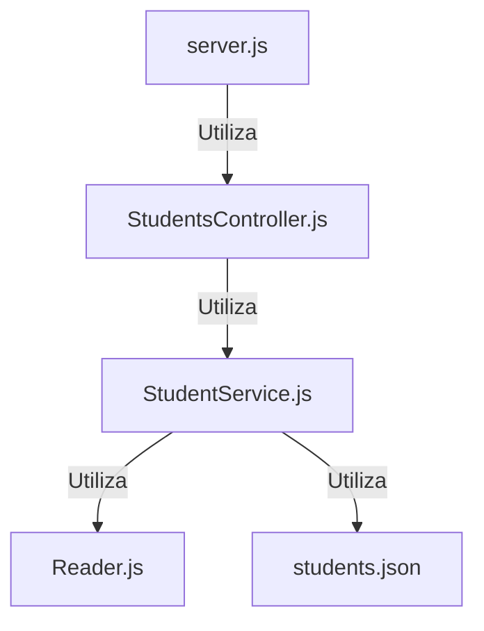
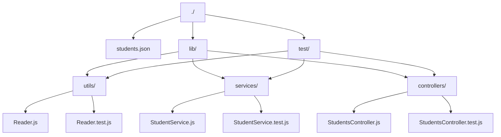

# Projecto Code challenge para Semana 4

## Practica para el curso fullstack en launchx para la mision nodejs

Saludos dev aqui podras encontrar las descripcion del proyecto.
En este diagrama se puede ver como esta estructurado el proyecto:

El siguiente diagrama de muestra la estructura de las carpetas y archivos:

