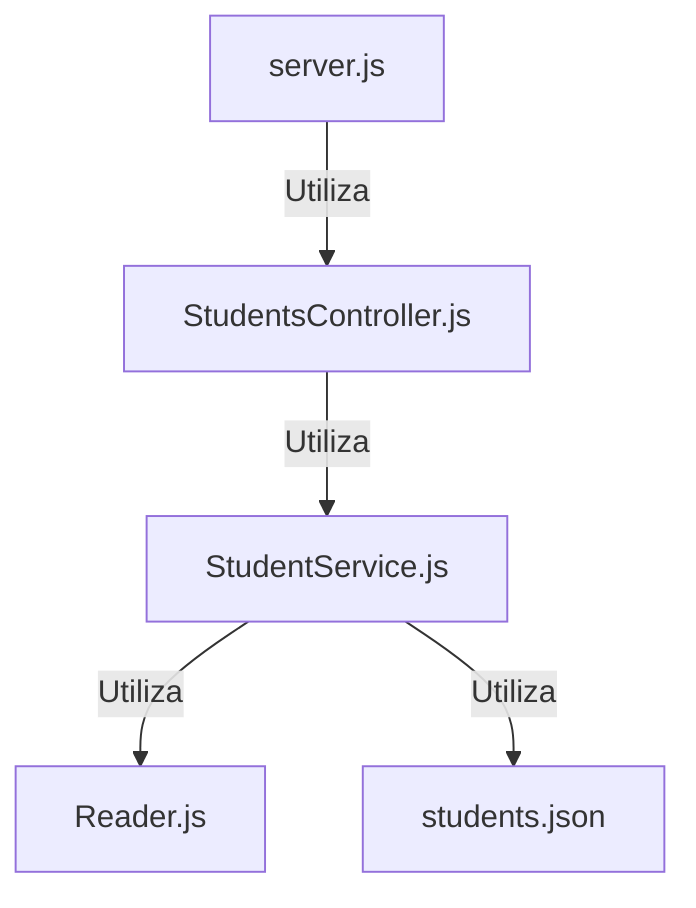
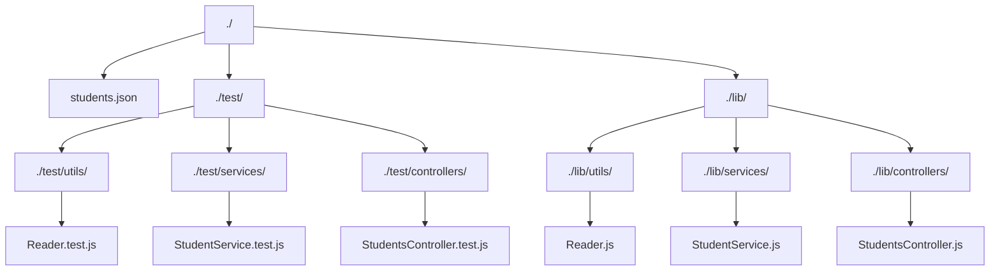

# Projecto Code challenge para Semana 4

## Practica para el curso fullstack en launchx para la mision nodejs

Saludos dev aqui podras encontrar las descripcion del proyecto.
En este diagrama se puede ver como esta estructurado el proyecto:

El siguiente diagrama de muestra la estructura de las carpetas y archivos:

Se implemetaron los siguientes endpoints en la API

| Endpoint | Request | Response |
|---|---|---|
| `localhost:3000/v1/students` | `localhost:3000/v1/students` | Deberás obtener la lista de todos los estudiantes |
| `localhost:3000/v1/students/certification` | `localhost:3000/v1/students/certification` | Deberás obtener la la lista de todos los estudiantes con certificacion |
| `localhost:3000/v1/students/credits/:credits` | `localhost:3000/v1/students/credits/500` | Deberás obtener la lista de estudiantes con 500 creditos o mas |

Las dependencias que se utilizaron fueron:
<ul>
  <li>express: para crear nuestro servidor para nuestra API</li>
  <li>Jest: para agreagar pruebas unitarias</li>
  <li>eslint: para darle estilo a nuestros archivos</li>
</ul>